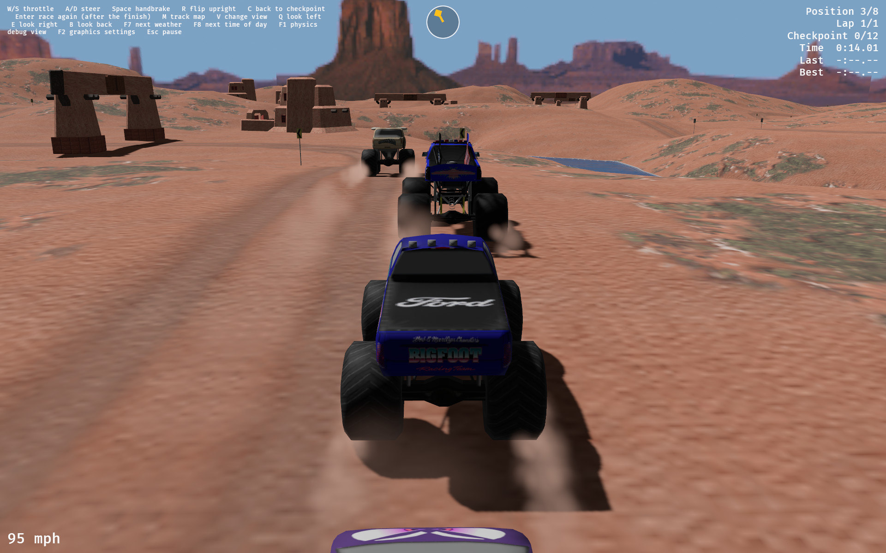
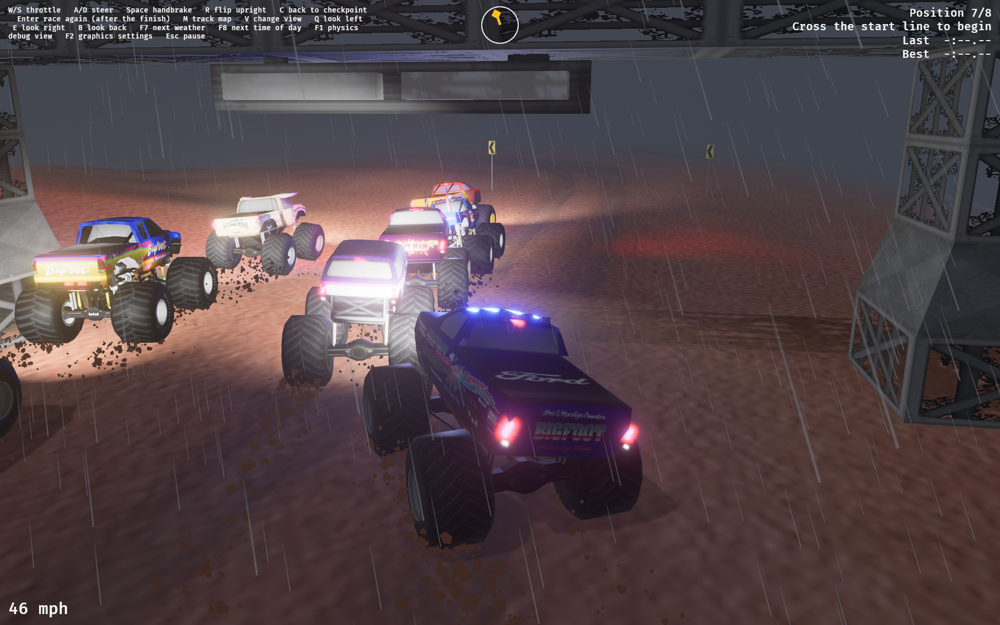

# Monster Truck Rural Ruckus

A modern replacement for *Monster Truck Madness 2* (MTM2, Terminal Reality / Microsoft,
1998), written in Rust on Bevy and Avian. Trucks race laps around a track and must pass
its checkpoints in order. The game loads MTM2's `.POD` archives directly: the original
tracks and trucks, and community-made ones.

This repository contains no MTM2 files. You must supply them from your own copy of the
game.





The screenshots show tracks and trucks from MTM2, loaded from the original game's files as well as community additions.

## Acknowledgements

The reverse-engineering work by [Juan Pablo Utreras](https://github.com/juanputrerasm)
is a major source of knowledge for this project, especially for understanding MTM2's
POD archives and file formats.

## 1. Install the tools

1. Install Rust with [rustup](https://rustup.rs). Bevy 0.19 needs a recent stable Rust.
   To update, use `rustup update`.
2. On Linux, install the libraries that Bevy needs. On Debian or Ubuntu:

   ```sh
   sudo apt install g++ pkg-config libx11-dev libasound2-dev libudev-dev libxkbcommon-x11-0 libwayland-dev libxkbcommon-dev
   ```

   For other distributions, refer to Bevy's
   [Linux dependencies](https://github.com/bevyengine/bevy/blob/main/docs/linux_dependencies.md).

## 2. Supply the game files

Put your files in these folders. Git ignores all three.

| Folder | Put in it |
| --- | --- |
| `tracks/` | Track archives (`.pod`) |
| `trucks/` | Truck archives (`.pod`) |
| `base/` | The base game's archives, or links to the `Shared` and `English` folders of your MTM2 CD |

Tracks and trucks borrow textures and models from the base game's archives. To link the
CD folders:

```sh
mkdir -p base
ln -s "/media/<you>/MTM2/Shared"  base/Shared
ln -s "/media/<you>/MTM2/English" base/English
```

You can also choose these folders in the game, at OPTIONS > FILES. If the game cannot
find the base game, it still runs, but borrowed parts show as plain grey shapes.

## 3. Start the game

```sh
cargo run
```

The first build takes some minutes. Then the front end opens. Choose a truck, a track and
a setup, and select GO.

To go directly to a race, name a track and a truck (in either order):

```sh
cargo run -- tracks/MyTrack.pod trucks/MyTruck.pod
```

Some useful options:

```sh
cargo run -- tracks/MyTrack.pod trucks/MyTruck.pod --opponents=7     # race against seven computer trucks
cargo run -- tracks/MyTrack.pod trucks/MyTruck.pod --weather=rain    # clear, overcast, fog, rain, storm, snow or random
cargo run -- tracks/MyTrack.pod trucks/MyTruck.pod --time=night      # day, dusk or night
cargo run -- --base-game=/path/to/MTM2                               # use the base game from this folder, for this run only
cargo run -- --race --builtin                                        # race the built-in truck and track (no files necessary)
```

[CONTRIBUTING.md](CONTRIBUTING.md) lists all the options.

### Release build

To play with the best frame rate, use the release profile.

```sh
cargo run --release
```
The release build takes more time than the dev build, because it optimises all of the code together.

Cargo writes the program to `target/release/`. You can start it without Cargo:

```sh
./target/release/monster_truck_rural_ruckus
```

Start it from the repository folder. The game finds `tracks/`, `trucks/`, `base/` and
`saves/` relative to the current folder.

If you change the code, use the dev profile to test it. The debugger shows more in a dev
build, and the reference figures in [docs/smoothness.md](docs/smoothness.md) are for dev
builds.

## 4. Drive

| Key | Does |
| --- | --- |
| W, S, A, D (or the arrows) | Throttle, brake and reverse, steer |
| Space | Handbrake |
| R | Flip the truck upright |
| C | Go back to the last checkpoint |
| Esc | Pause: continue, restart the whole race, save a screenshot (in `screenshots/`), or cancel the race |
| F2 | Graphics panel (F3 to F6 change its settings) |
| F7 | Next weather |

## More information

| Document | Contents |
| --- | --- |
| [CONTRIBUTING.md](CONTRIBUTING.md) | Build, run and test commands, all options, test policy |
| [ARCHITECTURE.md](ARCHITECTURE.md) | How the code is organised |
| [docs/roadmap.md](docs/roadmap.md) | The roadmap |
| [docs/formats/](docs/formats/README.md) | What is known about MTM2's file formats |
